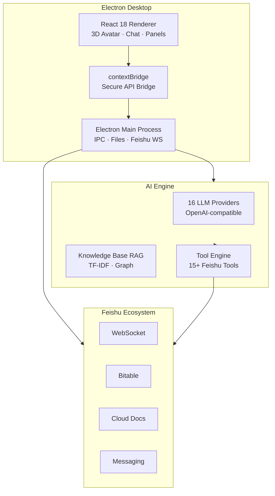

<p align="center">
  
</p>

<h1 align="center">CC Smart Companion</h1>
<h3 align="center">Desktop AI Companion · 16 LLM Providers · Feishu Integration · 3D Avatar</h3>

<p align="center">
  
  
  
  
  
</p>

<p align="center">
  <a href="#-demo">🎬 Demo</a> ·
  <a href="#-quick-start">🚀 Quick Start</a> ·
  <a href="#-features">✨ Features</a> ·
  <a href="#-architecture">🏗️ Architecture</a> ·
  <a href="#-download">📦 Download</a>
</p>

---

## 🎬 Demo

### Main Interface & 3D Character
<p align="center">
  
</p>

### AI Task Execution
<p align="center">
  
</p>

---

## ✨ Features

| Feature | Description |
|---------|-------------|
| 🤖 **16 LLM Providers** | OpenAI-compatible API. Switch between DeepSeek, Qwen, GLM, Kimi & more |
| 🎭 **3D Virtual Character** | Three.js r184 real-time rendering, emotions react to conversation |
| 🪶 **Feishu/Lark Integration** | WebSocket real-time messaging + Bitable + Docs + IM |
| 🧠 **Knowledge Base RAG** | TF-IDF local search engine, offline knowledge graph, persistent memory |
| 📊 **Excel → Bitable** | One-click Excel to Feishu Bitable, auto-infer 25+ field types |
| 💬 **Streaming Thought Panel** | Real-time AI reasoning display, collapsible thinking chain |
| 🔧 **Tool Call Visualization** | Individual cards per tool call, formatted params, live status |
| 📝 **Multi-Session** | Persistent chat history, topic switching, session search |
| 🔊 **TTS Voice** | Local Python TTS engine, character voice replies |
| 🧩 **Personality Profiling** | Auto-learns user preferences, builds character profile |
| 🛡️ **237 Unit + 7 E2E Tests** | Full test suite runs on every commit |

---

## 🚀 Quick Start

### Option 1: Download Installer (Recommended)

Get the latest `CC-Setup-v1.0.0.zip` from [Releases](https://github.com/MABIN-ship-it/-cc-smart-companion/releases), unzip and run `electron.exe`.

Requires: **Windows 10/11 x64**

### Option 2: Run from Source

```bash
git clone git@gitee.com:mabin-cici/cc-smart-companion.git
cd cc-smart-companion
npm install
npm run dev    # Start Vite dev server
npm start      # Start Electron (in another terminal)
```

### Configure AI Model

Fill in any OpenAI-compatible API details in the settings panel:

- **API URL**: `https://api.deepseek.com/v1` (or any of the 15 other providers)
- **API Key**: Your key
- **Model ID**: `deepseek-chat` (or others)

> Each model stores its own config. Switch with one click.

---

## 🏗️ Architecture



---

## 📂 Project Structure

```
cc-smart-companion/
├── electron/                 # Electron main process
│   ├── main.js              # IPC handlers + Feishu integration
│   ├── preload.js           # contextBridge API
│   └── feishu-ws.js         # Feishu WebSocket client
├── src/
│   ├── components/           # React UI
│   │   ├── ChatInterface.jsx   # Main chat interface
│   │   ├── ChatBubbleLayer.jsx # Chat bubbles + thought panel
│   │   ├── ToolCallCard.jsx    # Tool call cards
│   │   ├── CharacterScene.jsx  # 3D character (Three.js)
│   │   └── StageBackground.jsx # 2D holographic backdrop
│   ├── services/             # Business logic (40 modules)
│   │   ├── feishu.js           # Feishu API (70+ functions)
│   │   ├── feishuTools.js      # Feishu tools (15+ tools)
│   │   ├── sessionManager.js   # Chat sessions
│   │   ├── knowledgeBase.js    # Knowledge base (TF-IDF + RAG)
│   │   ├── excelParser.js      # Excel → Bitable parser
│   │   └── promptBuilder.js    # AI prompt builder
│   └── store/AppContext.jsx    # Global state
├── e2e/                      # Playwright E2E tests
├── python/tts_server.py      # TTS voice service
├── deploy.bat                # One-click deploy
└── assets/                   # Screenshots & GIFs
```

---

## 📦 Download

| Version | Type | Download |
|---------|------|----------|
| v1.0.0 | Portable (zip) | [CC-Setup-v1.0.0.zip](https://github.com/MABIN-ship-it/-cc-smart-companion/releases) |
| Latest | All formats | [Releases Page](https://github.com/MABIN-ship-it/-cc-smart-companion/releases) |

> Built with electron-builder. Auto-update configured.

---

## 🧪 Tests

```bash
npm test           # 237 unit tests (~20s)
npm run test:e2e   # 7 E2E tests (~40s)
npm run verify     # Test + Build + E2E in one command
```

All tests run automatically on every `git commit`.

---

## 🛠️ Tech Stack

| Layer | Technology |
|-------|------------|
| Desktop | Electron 42 |
| Frontend | React 18 + Vite 5 |
| 3D | Three.js r184 |
| AI API | OpenAI-compatible (16 providers) |
| Feishu SDK | @larksuiteoapi/node-sdk |
| Excel | ExcelJS + SheetJS |
| OCR | Tesseract.js |
| TTS | Python edge-tts |
| Testing | Vitest + Playwright |
| Build | electron-builder |

---

## 📄 License

MIT License

---

<p align="center">
  <sub>Made with ❤️ by CC Team</sub>
</p>
