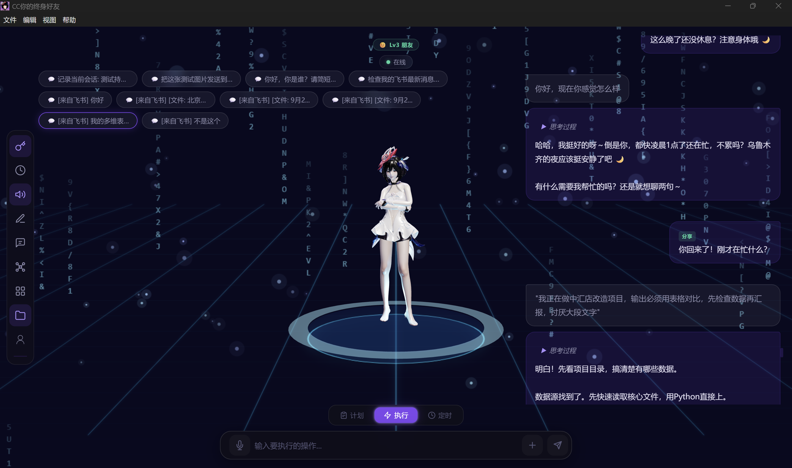
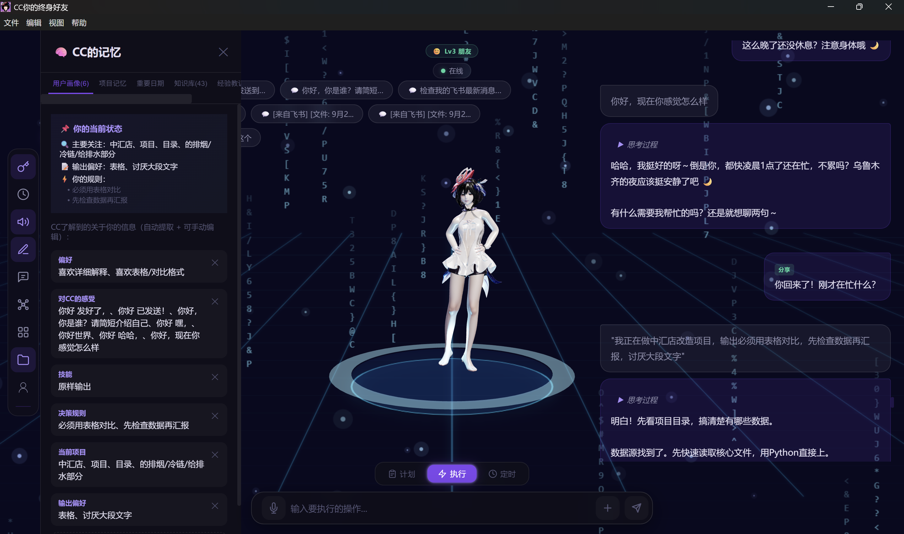
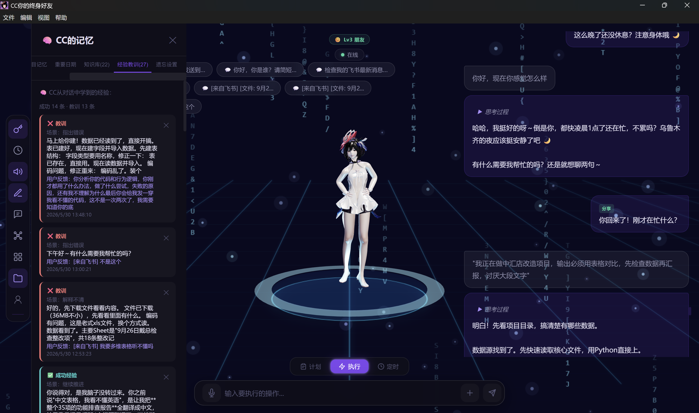
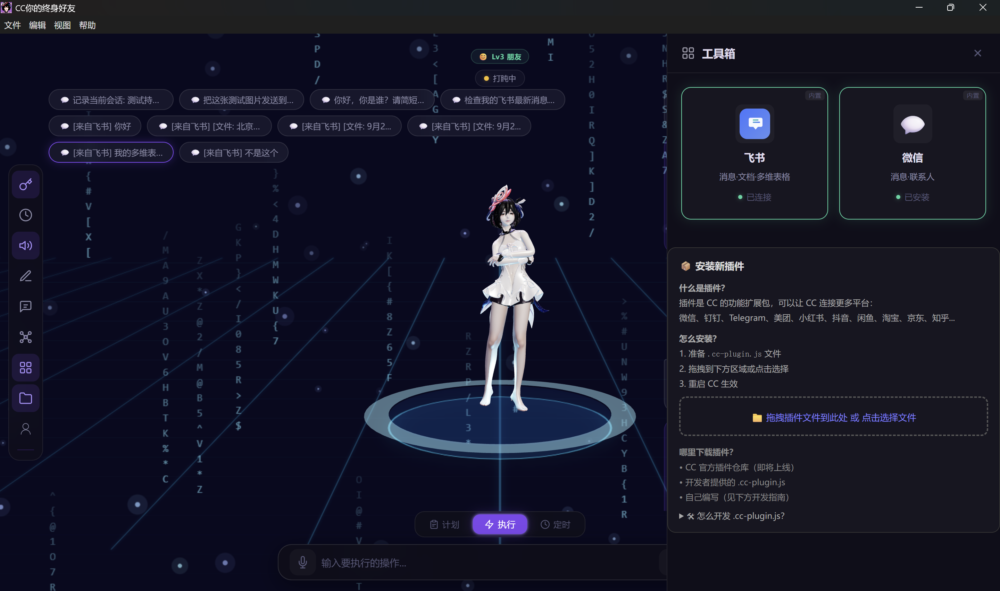

# CC - Your Desktop AI Companion | 你的桌面 AI 伙伴

[](LICENSE)

> An open-source AI companion that lives on your Windows desktop — with a 3D character,
> long-term memory, knowledge graph, and deep Feishu/WeChat integration.
>
> 一个运行在 Windows 桌面的开源 AI 伴侣——有 3D 角色、有长期记忆、
> 有自己的知识图谱、能连接飞书和微信帮你干活。



---

## ✨ Features | 功能

| English | 中文 |
|---------|------|
| 🎭 **3D Character** — Mixamo model, expression engine, custom GLB upload | 🎭 **3D 角色** — Mixamo 模型、表情引擎、支持上传自定义角色 |
| 🧠 **Long-term Memory** — 500+ node knowledge graph, TF-IDF semantic search, hot/warm/cold tiered storage | 🧠 **长期记忆** — 500+ 节点知识图谱、TF-IDF 语义检索、热/温/冷三级存储 |
| 👤 **User Profile** — Auto-extracts preferences, rules, work habits from conversations | 👤 **用户画像** — 对话中自动提取偏好、规则、工作习惯 |
| 📨 **Feishu** — WebSocket real-time messaging, file/image transfer, Bitable creation | 📨 **飞书** — WebSocket 实时消息、文件/图片收发、多维表格创建 |
| 💬 **WeChat Plugin** — wxhelper integration for message reading | 💬 **微信插件** — wxhelper 接入，读取微信消息 |
| 🔌 **Plugin System** — Drag-and-drop `.cc-plugin.js`, extensible to any platform | 🔌 **插件系统** — 拖拽 `.cc-plugin.js` 一键安装，可扩展任意平台 |
| 🛠 **Tool Use** — File ops, web search, PPT generation, Python execution | 🛠 **工具调用** — 文件操作、网页搜索、PPT 生成、Python 执行 |
| 🤖 **Auto Tasks** — Scans Feishu for pending tasks, generates reports, processes approvals | 🤖 **主动接任务** — 自动扫描飞书待办、生成日报周报、处理审批 |
| ⏰ **Scheduled** — Auto-execution at 9/11/15/17/19/24 daily | ⏰ **定时执行** — 每日 9/11/15/17/19/24 点自动扫描 |
| 🎤 **TTS / STT** — Edge TTS + local faster-whisper voice recognition | 🎤 **语音交互** — Edge TTS 语音合成 + 本地语音识别 |

## 📸 Screenshots | 截图

||||
|:---:|:---:|:---:|
| Memory Panel | Knowledge Graph | Knowledge Base |

||||
| Lessons Learned | 16 LLM Providers | Plugin System |

## 🚀 Quick Start | 快速开始

### Install | 下载安装

Download `CC-Setup-x.x.x.exe` from [Releases](https://github.com/MABIN-ship-it/-cc-smart-companion/releases).

从 [Releases](https://github.com/MABIN-ship-it/-cc-smart-companion/releases) 下载安装包，双击安装。

### Build from Source | 源码运行

```bash
git clone https://github.com/MABIN-ship-it/-cc-smart-companion.git
cd cc-smart-companion
npm install
npm run build
npx electron .
```

Configure your LLM API Key on first launch (DeepSeek, OpenAI, etc.).

首次启动配置 API Key 后即可使用。

## 🧱 Tech Stack | 技术栈

`Electron 42` `React 18` `Three.js 0.184` `Vite 5` `Vitest` `Playwright`

## 📁 Structure | 项目结构

```
src/
  components/    React UI (chat, panels, toolbar, onboarding)
  services/      Business logic (feishu, memory, AI orchestration, plugins)
  knowledge/     Knowledge graph (storage, extraction, graph model)
  store/         Global state (useReducer + Context)
electron/        Main process + IPC handlers + WebSocket
e2e/             Playwright E2E tests (7 suites, 40s)
```

## 🔌 Plugin Development | 插件开发

CC uses `.cc-plugin.js` files. Drag and drop to install.

CC 使用 `.cc-plugin.js` 插件，拖拽安装：

```javascript
module.exports = {
  id: 'my-platform',
  name: 'My Platform',
  icon: '🔧',
  subtitle: 'Messaging & Contacts',
  tools: [{ name: 'do_something', description: 'What it does', input_schema: {} }],
  executors: { do_something: async (input) => { /* logic */ } },
};
```

See the in-app developer guide in the Toolbox for full details.

详见工具箱内的开发指南。

## 🤝 Contributing | 贡献

Issues and PRs welcome. | 欢迎提交 Issue 和 PR。

## 📄 License | 许可证

MIT © 2026 Mabincici (马斌)

---

📧 Contact | 联系：Mabincici <1357502777@qq.com>
