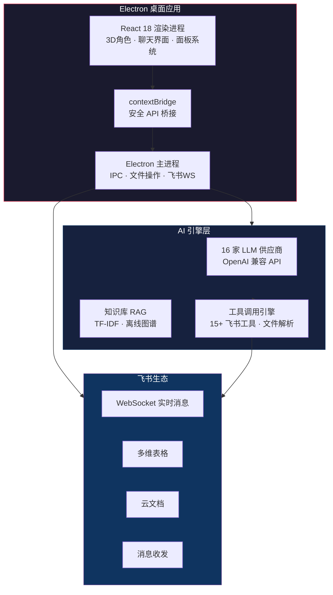

<p align="center">
  
</p>

<h1 align="center">CC 智能伙伴</h1>
<h3 align="center">桌面 AI 伴侣 · 16 家模型自由切换 · 飞书深度集成 · 3D 虚拟角色</h3>

<p align="center">
  
  
  
  
  
</p>

<p align="center">
  <a href="#-项目演示">🎬 演示</a> ·
  <a href="#-快速开始">🚀 快速开始</a> ·
  <a href="#-核心功能">✨ 功能</a> ·
  <a href="#-技术架构">🏗️ 架构</a> ·
  <a href="#-飞书集成">🪶 飞书</a> ·
  <a href="#-安装包下载">📦 下载</a>
</p>

---

## 🎬 项目演示

### 主界面 & 3D 角色交互
<p align="center">
  
</p>

### AI 任务执行效果
<p align="center">
  
</p>

---

## ✨ 核心功能

| 功能 | 说明 |
|------|------|
| 🤖 **16 家 AI 模型** | 兼容 OpenAI API 格式，自由切换 DeepSeek / Qwen / GLM / Kimi 等 |
| 🎭 **3D 虚拟角色** | Three.js r184 实时渲染，角色情绪随对话变化 |
| 🪶 **飞书深度集成** | WebSocket 实时消息 + 多维表格 + 云文档 + 消息收发 |
| 🧠 **知识库 RAG** | TF-IDF 本地搜索引擎，离线知识图谱，长期记忆 |
| 📊 **Excel→多维表格** | 一键将 Excel 转为飞书多维表格，智能字段类型推断（25+种） |
| 💬 **流式思考面板** | 实时展示 AI 推理过程，思考链可折叠、与回复正文分离 |
| 🔧 **工具调用可视化** | 每个工具调用独立卡片，参数格式化，状态实时更新 |
| 📝 **多会话管理** | 聊天记录持久化，话题切换，会话搜索 |
| 🔊 **TTS 语音合成** | 本地 Python TTS 服务，角色语音回复 |
| 🧩 **人物画像系统** | 自动学习用户偏好，构建性格档案 |
| 🛡️ **237 单元 + 7 E2E** | 每次提交自动全量测试 |

---

## 🚀 快速开始

### 方式一：下载安装包（推荐）

从 [Releases](https://github.com/MABIN-ship-it/-cc-smart-companion/releases) 下载最新 `CC-Setup-v1.0.0.zip`，解压后双击 `electron.exe` 即可。

系统要求：**Windows 10/11 x64**

### 方式二：源码运行

```bash
# 克隆仓库
git clone git@gitee.com:mabin-cici/cc-smart-companion.git
cd cc-smart-companion

# 安装依赖
npm install

# 启动开发模式
npm run dev

# 另开终端，启动 Electron
npm start
```

### 配置 AI 模型

启动后在设置面板中填入任意兼容 OpenAI API 的模型信息：

- **API 地址**：`https://api.deepseek.com/v1`（或其他 15 家供应商）
- **API Key**：你的密钥
- **模型 ID**：`deepseek-chat`（或其他）

> 每个模型独立配置，一键切换。

---

## 🏗️ 技术架构



## 📂 项目结构

```
cc-smart-companion/
├── electron/                 # Electron 主进程
│   ├── main.js              # IPC handlers + 飞书集成
│   ├── preload.js           # contextBridge API
│   └── feishu-ws.js         # 飞书 WebSocket 客户端
├── src/
│   ├── components/           # React UI 组件
│   │   ├── ChatInterface.jsx   # 主交互界面
│   │   ├── ChatBubbleLayer.jsx # 聊天气泡 + 思考面板
│   │   ├── ToolCallCard.jsx    # 工具调用卡片
│   │   ├── CharacterScene.jsx  # 3D 角色场景 (Three.js)
│   │   └── StageBackground.jsx # 2D 全息舞台背景
│   ├── services/             # 业务逻辑 (40 个模块)
│   │   ├── feishu.js           # 飞书 API (70+ 函数)
│   │   ├── feishuTools.js      # 飞书工具定义 + 执行器
│   │   ├── sessionManager.js   # 聊天会话管理
│   │   ├── knowledgeBase.js    # 知识库 (TF-IDF + RAG)
│   │   ├── excelParser.js      # Excel → 多维表格解析引擎
│   │   └── promptBuilder.js    # AI 提示词构建器
│   └── store/AppContext.jsx    # 全局状态管理
├── e2e/                      # Playwright E2E 测试
├── python/tts_server.py      # TTS 语音服务
├── deploy.bat                # 一键部署脚本
└── assets/                   # 截图 & GIF 演示
```

---

## 🪶 飞书集成架构

```
飞书服务器
  ↕ WebSocket (实时双向)
feishu-ws.js (主进程)
  ↕ IPC
main.js → preload.js → 渲染进程
  ↕ 工具调用
feishuTools.js → feishu.js → 飞书开放平台 API
  ├── 多维表格 (Base / Table / Field / Record 全 CRUD)
  ├── 云文档 (创建 / 读取 / 更新)
  ├── 消息收发 (文本 / 图片 / 文件 / 富文本)
  └── Excel → 多维表格一键转换
```

**支持的飞书操作：**

- 📨 实时消息收发（WebSocket 长连接，支持文本/图片/文件）
- 📊 多维表格全生命周期（建库→建表→加字段→写数据→建视图）
- 📄 云文档与知识库
- 🔄 Excel/CSV → 多维表格自动转换（26 种字段类型智能推断）
- 📝 智能表格模板库

---

## 📦 安装包下载

| 版本 | 类型 | 下载 |
|------|------|------|
| v1.0.0 | 便携版 (zip) | [CC-Setup-v1.0.0.zip](https://github.com/MABIN-ship-it/-cc-smart-companion/releases) |
| 最新版 | 所有格式 | [Releases 页面](https://github.com/MABIN-ship-it/-cc-smart-companion/releases) |

> 安装包通过 electron-builder 构建，自动更新已配置。

---

## 🧪 测试

```bash
# 237 个单元测试 (~20s)
npm test

# 7 个 E2E 测试 (~40s)
npm run test:e2e

# 一键验证 (测试 + 构建 + E2E)
npm run verify
```

每次 `git commit` 自动执行全部测试，通过后才允许提交。

---

## 🛠️ 技术栈

| 层 | 技术 |
|----|------|
| 桌面框架 | Electron 42 |
| 前端 | React 18 + Vite 5 |
| 3D 渲染 | Three.js r184 |
| AI 接口 | OpenAI 兼容 API (16 家供应商) |
| 飞书 SDK | @larksuiteoapi/node-sdk |
| Excel 解析 | ExcelJS + SheetJS/xlsx |
| OCR | Tesseract.js |
| TTS | Python edge-tts |
| 测试 | Vitest + Playwright |
| 构建 | electron-builder |

---

## 🤝 贡献

欢迎提交 Issue 和 PR！

```bash
# 开发流程
git checkout -b feat/your-feature
npm run dev          # Vite 热更新开发
npm test             # 改完跑测试
npm run verify       # 提交前全量验证
git commit -m "feat: 你的功能描述"
```

### 提交规范

| 前缀 | 含义 |
|------|------|
| `feat` | 新功能 |
| `fix` | Bug 修复 |
| `docs` | 文档 |
| `test` | 测试 |
| `chore` | 构建/工具 |

---

## 📄 许可证

MIT License

---

<p align="center">
  <sub>Made with ❤️ by CC Team | 华人牌2026款</sub>
</p>
